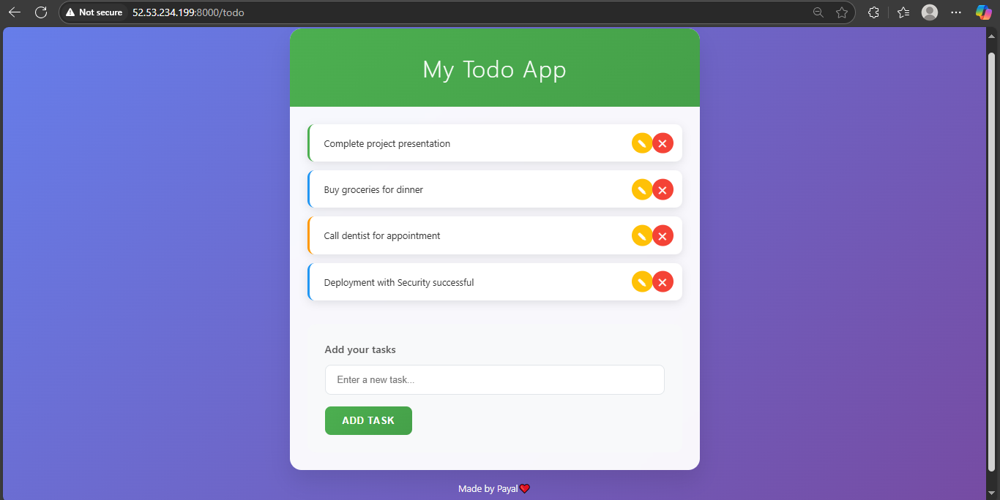

## Nodejs automation with DevSecops 

- Userdata for ubuntu instance

```bash
#!/bin/bash
apt-get update -y
apt-get install -y docker.io
systemctl start docker
systemctl enable docker
usermod -aG docker ubuntu
apt-get install -y curl git
```

- Run SonarQube server

``` bash
docker run -itd --name SonarQube-Server -p 9000:9000 sonarqube:lts-community
```
 

